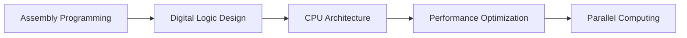

<div align="center">

# 🖥️ Computer Organization and Design
### *Organosi kai Sxediash Ypologistwn*

[](https://github.com)
[](https://github.com)
[](https://github.com)
[](https://github.com)

*Comprehensive lab assignments covering fundamental concepts in computer engineering*

---

</div>

## 📋 Table of Contents

- [📚 Course Overview](#-course-overview)
- [🛠️ Prerequisites & Setup](#️-prerequisites--setup)
- [🔬 Laboratory Assignments](#-laboratory-assignments)
- [🏗️ Build & Compilation](#️-build--compilation)
- [📊 Performance Guidelines](#-performance-guidelines)
- [📖 Documentation](#-documentation)
- [👥 Contributors](#-contributors)
- [🚀 Quick Start](#-quick-start)

---

## 📚 Course Overview

<div align="center">

| **Domain** | **Technologies** | **Skills Developed** |
|------------|------------------|---------------------|
| 🔧 **Low-Level Programming** | MIPS Assembly | System calls, bitwise operations, control flow |
| ⚡ **Digital Design** | Verilog HDL | Circuit design, simulation, verification |
| 🖥️ **Computer Architecture** | Custom CPU Design | Instruction sets, control units, datapaths |
| 🚀 **High-Performance Computing** | C + OpenMP/pthreads | Parallel algorithms, optimization |
| 📈 **Performance Analysis** | Profiling Tools | Memory management, cache optimization |

</div>

### 🎯 Learning Objectives



---

## 🛠️ Prerequisites & Setup

### 📦 Required Software Stack

<details>
<summary><b>🔧 Development Tools (Click to expand)</b></summary>

| **Tool Category** | **Software** | **Purpose** |
|-------------------|--------------|-------------|
| **Assembly Simulation** | MARS/SPIM | MIPS program execution |
| **HDL Simulation** | Icarus Verilog | Verilog compilation & simulation |
| **Waveform Analysis** | GTKWave | Signal visualization |
| **C/C++ Development** | GCC + OpenMP | High-performance compilation |

</details>

### 🐧 Installation (Ubuntu/Debian)

```bash
# Update package repositories
sudo apt update && sudo apt upgrade -y

# Install Verilog development suite
sudo apt install -y iverilog gtkwave

# Install C/C++ development tools
sudo apt install -y gcc build-essential libomp-dev

# Install additional utilities
sudo apt install -y make git wget curl
```

### 🍎 Installation (macOS)

```bash
# Using Homebrew
brew install icarus-verilog gtkwave gcc
```

### 🪟 Installation (Windows)

- Download MARS from [Missouri State University](http://courses.missouristate.edu/KenVollmar/mars/)
- Install [Icarus Verilog for Windows](http://bleyer.org/icarus/)
- Use WSL2 for Linux-compatible development

---

## 🔬 Laboratory Assignments

### 🏁 Lab 1: Assembly Programming Fundamentals
<div align="center">


</div>

**📁 Files:** `ask1.asm`, `ask2.asm`

**🎯 Learning Goals:**
- Master MIPS assembly syntax and instruction set
- Implement bitwise operations and arithmetic
- Handle user input/output through system calls
- Develop efficient counting algorithms

**💡 Key Implementation:**
> **Leading Zero Counter** - Calculates the number of leading zeros in a 32-bit integer using bit manipulation techniques.

```bash
cd lab1
mars ask1.asm  # Run with MARS simulator
```

---

### 🔄 Lab 2: Advanced Assembly Techniques
<div align="center">


</div>

**📁 Files:** `ask1.asm`, `ask2.asm`, `ex2.asm`

**🎯 Learning Goals:**
- Advanced MIPS programming patterns
- Subroutine design and stack management
- File I/O operations and error handling
- Complex algorithmic implementations

```bash
cd lab2
mars ask1.asm
```

---

### 🎯 Lab 3: Assembly Mastery
<div align="center">


</div>

**📁 Files:** `ask1.asm`

**🎯 Learning Goals:**
- Assembly optimization techniques
- Complex problem-solving strategies
- Code efficiency and performance tuning

---

### ⚡ Lab 4: Digital Logic Design
<div align="center">


</div>

**📁 Files:** `library.v`, `testbench.v`, `Lab4.pdf`

**🎯 Learning Goals:**
- Verilog HDL syntax and modeling techniques
- Combinational and sequential circuit design
- Testbench development and verification
- Simulation and debugging workflows

```bash
cd lab4
iverilog -o test library.v testbench.v
vvp test
gtkwave tb_dumpfile.vcd  # Visualize waveforms
```

---

### 🖥️ Lab 6: CPU Architecture Implementation
<div align="center">


</div>

**📁 Core Files:** `cpu.v`, `control.v`, `library.v`, `testbench.v`, `program.asm`

**🎯 Learning Goals:**
- Complete CPU design from scratch
- Control unit and datapath integration
- Instruction set architecture (ISA) implementation
- Assembly program execution verification

**🔧 Advanced Features:**
- ✅ Custom instruction set architecture
- ✅ Program memory initialization from hex files
- ✅ Comprehensive waveform analysis
- ✅ Automated build system with Makefile

```bash
cd lab6
make all  # One-command build, simulate, and visualize
```

**🔍 Manual Execution:**
```bash
iverilog -Wall -Winfloop -o lab6a.out control.v library.v cpu.v testbench.v
vvp lab6a.out
gtkwave tb_dumpfile.vcd waveform.gtkw
```

---

### 🚀 Lab 7: Enhanced CPU Architecture
<div align="center">


</div>

**🎯 Learning Goals:**
- Advanced CPU optimization techniques
- Extended instruction set implementation
- Performance enhancement strategies
- Complex control logic design

```bash
cd lab7
make all
```

---

### 🔄 Lab 8: Parallel Programming - K-means Clustering
<div align="center">


</div>

**📁 Core Files:** `kmeans.c`, `kmeans_omp2.c`, `qdbmp.c`, `qdbmp.h`

**🎯 Learning Goals:**
- Machine learning algorithm implementation
- Parallel programming with OpenMP and pthreads
- Image processing and BMP format handling
- Performance comparison and optimization

**🖼️ Features:**
- 🎨 BMP image processing library
- ⚡ Multiple parallelization strategies
- 📊 Performance benchmarking tools
- 🔧 Compiler optimization flags

```bash
cd lab8
# Standard sequential version
make all

# OpenMP parallel version
gcc -O3 -fopenmp -o kmeans_omp kmeans_omp2.c qdbmp.c

# Execute clustering
./kmeans input.bmp output.bmp 8      # 8 clusters
./kmeans_omp input.bmp output.bmp 8  # Parallel version
```

**🧪 Alternative Implementations:**
```bash
# Explore different parallelization approaches
cd multithreading_tries/
gcc -O3 -pthread -o kmeans_pthread kmeans_pthread.c ../qdbmp.c
```

---

### 📊 Lab 9: Performance Analysis & Memory Optimization
<div align="center">


</div>

**📁 Files:** `lab9_program.c`, `getmemusage.c`, `loop1`, `loop2`

**🎯 Learning Goals:**
- Memory usage profiling and analysis
- Loop optimization and vectorization
- Cache efficiency and performance tuning
- Compiler optimization exploration

```bash
cd lab9
# Compile and run main program
gcc -O2 -o lab9_program lab9_program.c
./lab9_program

# Memory usage analysis
gcc -o getmemusage getmemusage.c
./getmemusage

# Performance comparison
time ./loop1 && time ./loop1_opt
time ./loop2 && time ./loop2_opt
```

---

## 🏗️ Build & Compilation

### ⚡ Verilog HDL Projects

<details>
<summary><b>🔧 Compilation Commands</b></summary>

```bash
# Standard compilation with warnings
iverilog -Wall -Winfloop -o <output> <source_files.v>

# Execute simulation
vvp <output_file>

# Advanced simulation with timing
iverilog -g2012 -Wall -o <output> <source_files.v>

# Generate VCD for waveform analysis
# (ensure $dumpfile and $dumpvars in testbench)
gtkwave <waveform_file.vcd>
```

</details>

### 🚀 C/C++ Projects

<details>
<summary><b>🔧 Optimization Levels</b></summary>

```bash
# Debug build
gcc -g -Wall -std=c99 -o <executable> <source.c>

# Standard optimization
gcc -O2 -Wall -std=c99 -o <executable> <source.c>

# High-performance build
gcc -O3 -march=native -funroll-loops -o <executable> <source.c>

# OpenMP parallel compilation
gcc -O3 -fopenmp -Wall -std=c99 -o <executable> <source.c>

# Maximum optimization (use with caution)
gcc -Ofast -march=native -flto -o <executable> <source.c>
```

</details>

---

## 📊 Performance Guidelines

### 🎯 Optimization Strategies

| **Lab Type** | **Focus Area** | **Key Techniques** |
|--------------|----------------|--------------------|
| **Assembly** | Instruction Efficiency | Register reuse, loop unrolling, branch prediction |
| **Verilog** | Hardware Resources | Timing analysis, resource sharing, pipeline design |
| **C Programs** | Computational Speed | Compiler flags, algorithmic optimization, parallelization |

### 📈 Benchmarking Best Practices

```bash
# Timing measurements
time ./program_name

# Memory profiling
valgrind --tool=massif ./program_name

# CPU profiling  
perf record ./program_name
perf report
```

---

## 📖 Documentation

Each laboratory includes comprehensive documentation:

- 📋 **Theoretical Background** - Concepts and principles
- 🎯 **Implementation Requirements** - Detailed specifications
- 📊 **Expected Outputs** - Sample results and verification
- 📈 **Performance Analysis** - Optimization guidelines
- 🔬 **Testing Procedures** - Validation methodologies

---

## 👥 Contributors

<div align="center">

| **Author** | **Role** | **Contribution** |
|------------|----------|------------------|
| **Emmanouil Raftopoulos** | Co-Developer | Architecture design, Verilog implementation |
| **Charalampos Zachariadis** | Co-Developer | Assembly programming, C optimization |

</div>

---

## 🚀 Quick Start

### 1️⃣ **Clone Repository**
```bash
git clone <repository-url>
cd organosi-main
```

### 2️⃣ **Install Dependencies**
```bash
sudo apt install iverilog gtkwave gcc libomp-dev build-essential
```

### 3️⃣ **Choose Your Lab**
```bash
cd lab[1-9]  # Navigate to desired lab
```

### 4️⃣ **Follow Lab Instructions**
- Read the corresponding `Lab*.pdf` documentation
- Execute the provided build commands
- Analyze results and waveforms

### 5️⃣ **Explore and Learn**
- Modify parameters and observe changes
- Compare different implementation approaches
- Benchmark performance improvements

---

<div align="center">

### 🎓 *Academic Excellence in Computer Engineering*

[](https://github.com)

---

*"Understanding computers from the ground up - from electrons to algorithms"*

</div>